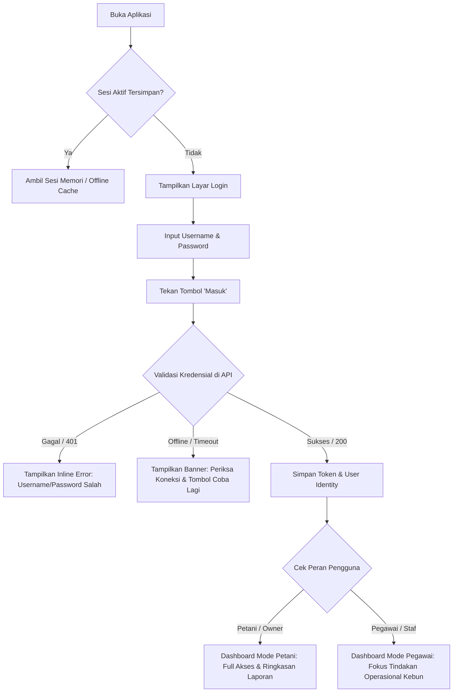
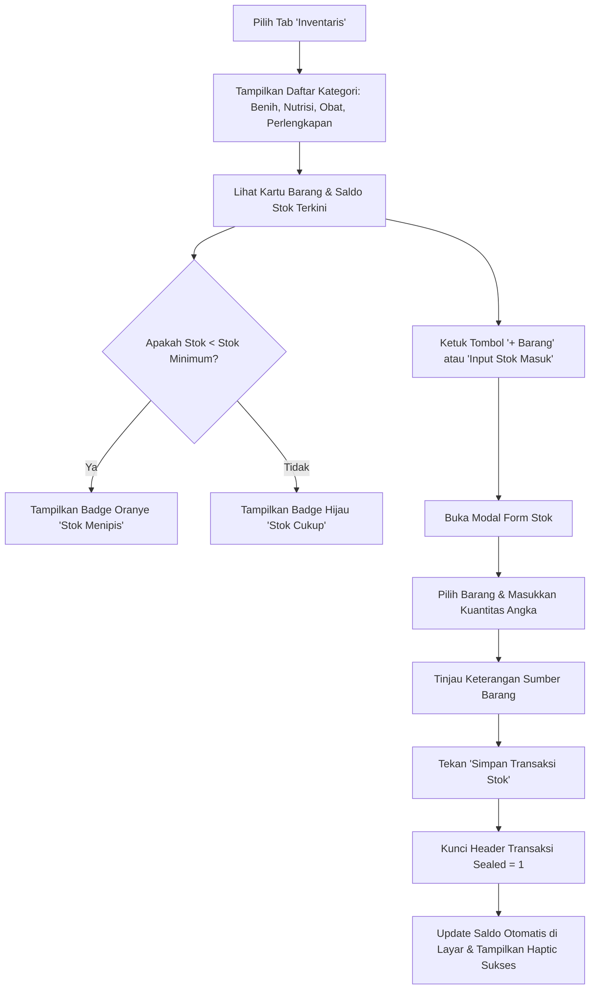
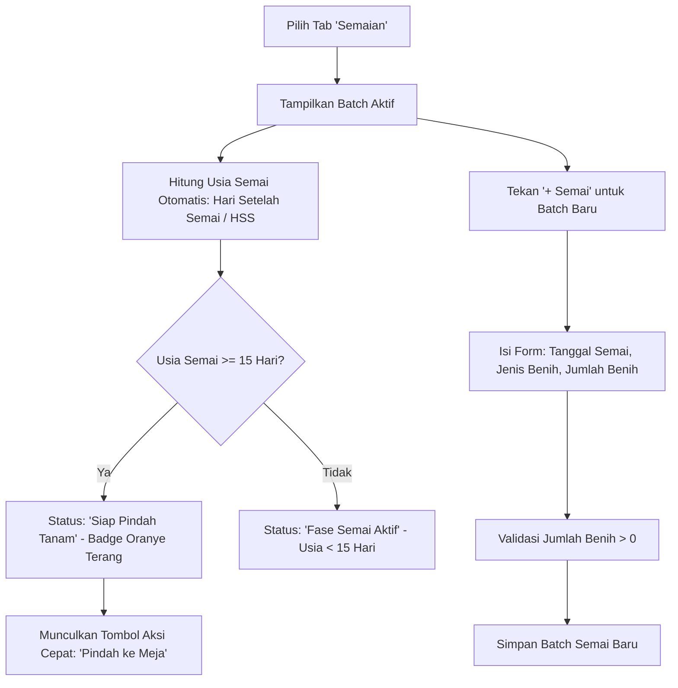
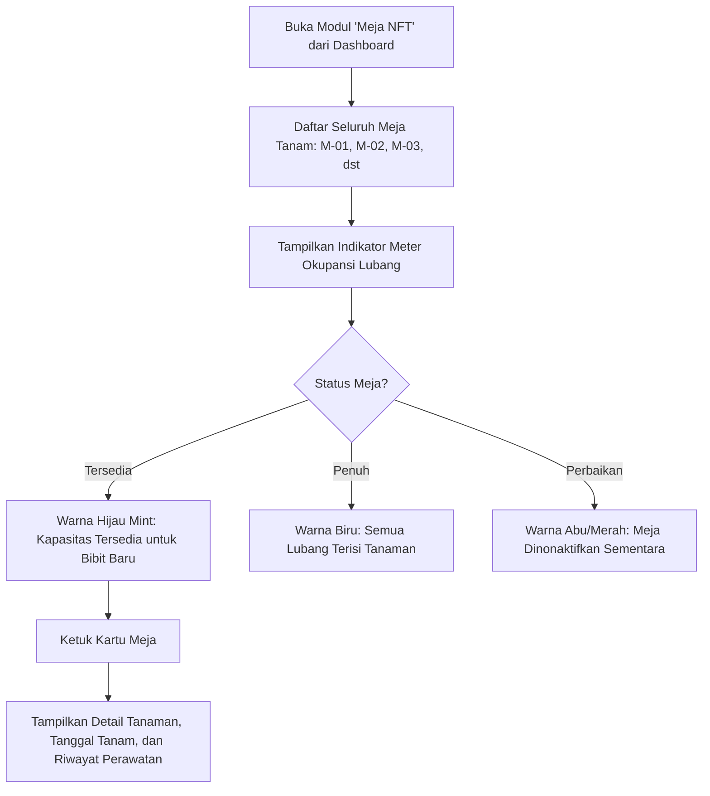
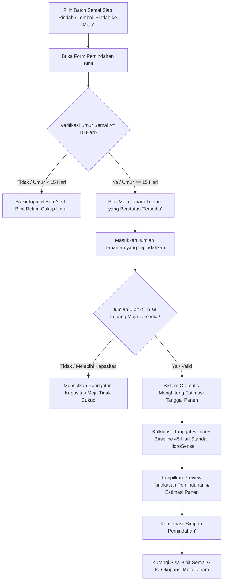
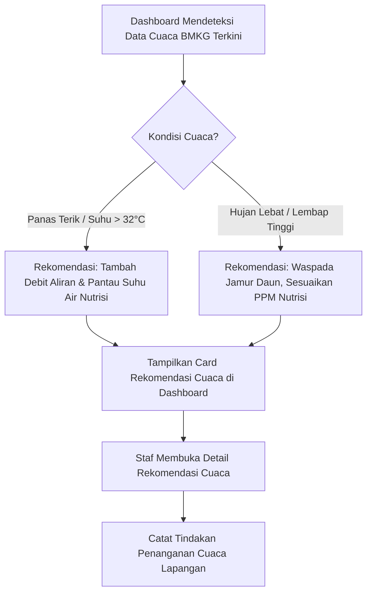

# Modul 03: Arsitektur Navigasi & Diagram Alur Pengguna (User Flows & Navigation)

Dokumen ini memetakan arsitektur navigasi antarmuka dan alur pengguna (*User Flows*) untuk seluruh fitur inti aplikasi **HidroSense Mobile** (B000 hingga B009) mengacu pada standar **Apple Human Interface Guidelines (HIG)**.

---

## 1. Arsitektur Informasi & Hirarki Navigasi

Sistem navigasi HidroSense dibagi menjadi 3 pola utama sesuai standar Apple HIG:

```
[Level 0: Root Gate] ---> Belum Login: [Login Page]
                     ---> Sudah Login: [Main Page / Tab Bar]
                                       |-- Tab 1: [Beranda / Dashboard]
                                       |-- Tab 2: [Inventaris & Stok]
                                       |-- Tab 3: [Semaian / Nursery]
```

### 3 Pola Navigasi HIG:
1. **Persistent Tab Bar (Layar Utama):**
   - Menampung 3 tujuan utama: *Beranda*, *Inventaris*, dan *Semaian*.
   - Tab Bar tetap terlihat di layar root dan memberikan orientasi instan kepada pengguna di mana mereka berada.
2. **Hierarchical Push Navigation (Layar Detail):**
   - Menggunakan `Navigator.push()` dengan tombol kembali (*Back Button*) di kiri atas yang jelas.
   - Contoh: Ketuk Meja NFT `M-01` di dashboard $\rightarrow$ Masuk ke `DetailTanamanMejaPage`.
3. **Modal Presentation / Bottom Sheets (Layar Form & Input Cepat):**
   - Menggunakan bottom sheet atau full-screen modal dengan tombol "Batal" di kiri dan "Simpan" di kanan.
   - Contoh: Form Tambah Barang, Form Catat Semai, Form Pindah Bibit.

---

## 2. Alur Pengguna Inti (Core User Flows)

### Flow 1: Autentikasi & Pembagian Peran (B002)

Pengguna masuk menggunakan kredensial baku dan aplikasi menyesuaikan hak akses berdasarkan peran (`petani` vs `pegawai`).



---

### Flow 2: Manajemen Inventaris & Buku Besar Stok (B005 & B006)

Pengguna memeriksa ketersediaan benih/nutrisi dan mencatat penambahan stok baru ke dalam buku besar stok yang tersimpan aman (*sealed*).



---

### Flow 3: Siklus Penyemaian Benih (B007)

Staf kebun mencatat semaian baru, memantau usia semai harian (HSS), dan menerima alert visual saat semaian siap pindah tanam.



---

### Flow 4: Pemantauan Meja Tanam NFT (B008)

Pemantauan ketersediaan lubang tanam pada meja hidroponik sebelum bibit dipindahkan.



---

### Flow 5: Pemindahan Bibit ke Meja Tanam & Estimasi Panen (B009)

Alur kritis pemindahan bibit dari baki semai ke meja NFT dengan verifikasi standar umur 15 hari dan baseline panen 45 hari.



---

### Flow 6: Rekomendasi Cuaca BMKG & Tindakan Nutrisi

Sistem sinkronisasi prakiraan cuaca lokal untuk memandu tindakan staf lapangan.


