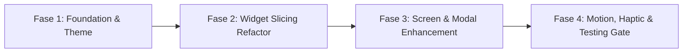

# Modul 05: Peta Jalan Implementasi & Rekonstruksi Kode (Implementation Roadmap)

Dokumen ini merinci hasil audit antarmuka yang ada saat ini (*existing UI slicing*) dan rencana bertahap (*Phased Execution Plan*) untuk merekonstruksi kode Flutter mengacu pada pedoman **Apple Human Interface Guidelines (HIG)**.

---

## 1. Audit Komponen & Layar Eksisting

Berdasarkan inventarisasi kode pada direktori [apps/mobile/lib/views/](file:///d:/Dev/Projects/hidrosense/apps/mobile/lib/views), terdapat **21 berkas halaman (pages)**, **18 komponen badan (components)**, dan **27 widget interaktif (widgets)**.

### Temuan Audit & Anti-Pattern yang Perlu Dibenahi:

| Komponen / Layar | Kondisi Eksisting | Kebutuhan Penyelarasan Apple HIG |
|---|---|---|
| **Root Application (`main.dart`)** | Belum mendefinisikan `theme: ...`, hanya mengandalkan default Material. | Integrasikan `AppTheme.lightTheme` berbasis token desain HIG terpusat. |
| **Pewarnaan Widget** | Nilai hex diulang-ulang di setiap widget (misal: `Color.fromRGBO(250, 250, 247, 1)` muncul di puluhan file). | Ganti seluruh hardcoded color dengan konstanta semantik `AppColors.*`. |
| **Skala Tipografi** | Ukuran font dan weight didefinisikan ad-hoc di setiap widget teks. | Terapkan hierarki `AppTypography.*` (*Large Title*, *Title 1-3*, *Headline*, *Body*, *Footnote*). |
| **Target Sentuh Tombol** | Beberapa tombol kecil memiliki tinggi $<40\text{ pt}$. | Pastikan area ketuk interaktif minimal $44 \times 44\text{ pt}$ (*Touch Target Heuristic*). |
| **Formulir & Input** | Sebagian input menggunakan dialog popup untuk pesan error. | Standarisasi input dengan label tersemat (*pinned label*), inline error, dan unit suffix badge. |
| **Navigasi Form Tambah** | Form tambah dibuka sebagai full page standard. | Ubah form input cepat (+ Barang, + Semai) menjadi *Modal Bottom Sheet* dengan grabber handle. |
| **Indikator Progres** | Nilai progres melompat seketika saat data berganti. | Terapkan animasi interpolasi cairan `TweenAnimationBuilder` (450ms, `easeOutCubic`). |

---

## 2. Rencana Eksekusi Bertahap (Phased Roadmap)



---

### Fase 1: Fondasi Token & Tema Aplikasi (Design Foundation)
- [x] Membuat berkas token desain terpusat: [apps/mobile/lib/views/theme/app_theme.dart](file:///d:/Dev/Projects/hidrosense/apps/mobile/lib/views/theme/app_theme.dart).
  - Menyusun token `AppColors` (mempertahankan 100% palet eksisting: Mint `#39C6C5`, Teal `#168681`, Lime `#DDF45A`, Navy `#172231`, Warm Canvas `#FAFAF7`, Orange `#FF9A55`).
  - Menyusun token `AppTypography` dengan font Inter, letter spacing rapat, dan dukungan `tabularFigures` untuk angka data.
  - Menyusun token `AppSpacing` (kelipatan 4pt & 8pt) dan `AppRadius` (*continuous squircle radii*).
- [ ] Daftarkan `AppTheme.lightTheme` ke dalam `MaterialApp` di [main.dart](file:///d:/Dev/Projects/hidrosense/apps/mobile/lib/main.dart).

---

### Fase 2: Standarisasi Widget Inti (Core Widgets Refactor)
- [ ] **Tombol Aksi (`RowButton` & `ColButton`):**
  - Standarisasi tinggi tombol minimal $52\text{ pt}$ (nyaman untuk ibu jari).
  - Terapkan micro-scale `0.975` dengan kurva `easeOutCubic`.
  - Integrasikan umpan balik haptik `HapticFeedback.lightImpact()` pada setiap ketukan.
- [ ] **Kartu Interaktif (`RowInfoCardMd` & `BaseColCard`):**
  - Gunakan `AppRadius.card` ($16\text{ pt}$) dengan garis tepi halus `AppColors.borderLight`.
  - Berikan efek bayangan difusi lembut (*soft diffusion shadow* Level 1).
- [ ] **Badge Status (`CapsuleBadge` & `StockStatusBadge`):**
  - Standarisasi bentuk pill $999\text{ pt}$ dengan padding horizontal $10\text{ pt}$ dan teks `Caption 1` SemiBold.
- [ ] **Form Input Field (`CustomInputField` & `CustomDropdownField`):**
  - Desain ulang border fokus dengan warna `AppColors.primaryMint` (1.5pt).
  - Pinned label di atas kolom dan pesan error sejajar di bawah kolom.

---

### Fase 3: Rekonstruksi Halaman & Alur Pengguna (Pages & Sheets)
- [ ] **Layar Login (`login_page.dart`):**
  - Rapikan padding responsive max-width $400\text{ pt}$.
  - Tambahkan transisi fokus otomatis saat menekan "Enter / Next" pada keyboard.
- [ ] **Dashboard (`dashboard_body.dart`):**
  - Header adaptif dengan Large Title *"HidroSense"*.
  - Kartu peringatan darurat (*Semaian Siap Pindah* & *Cuaca BMKG*) diletakkan di section teratas.
  - Quick action buttons (4 tombol pintas) diselaraskan dalam grid seimbang dengan target sentuh $\ge 48\text{ pt}$.
- [ ] **Inventaris & Saldo Stok (`connected_inventory_page.dart`):**
  - Saldo stok menggunakan `AppTypography.headline` dengan fitur `tabularFigures`.
  - Tambahkan badge status otomatis: *"Stok Menipis"* (oranye) jika di bawah threshold.
- [ ] **Semaian & Nursery (`penyemaian_body.dart` & `info_seeding_page.dart`):**
  - Tampilkan usia semai HSS (Hari Setelah Semai) secara mencolok.
  - Jika $\ge 15$ hari, munculkan tombol *"Pindah ke Meja"* dengan warna Lime kontras.
- [ ] **Pemindahan Bibit ke Meja NFT (B009):**
  - Buat form pemindahan bibit sebagai *Modal Bottom Sheet* yang memvalidasi sisa lubang meja dan menghitung otomatis estimasi panen 45 hari.

---

### Fase 4: Integrasi Motion, Ergonomi Haptik & Verification Gate
- [ ] Tambahkan `HapticFeedback` pada seluruh event:
  - `selectionClick()` saat berpindah tab.
  - `mediumImpact()` saat form berhasil disimpan.
  - `heavyImpact()` saat aksi pembatalan / hapus.
- [ ] Tambahkan animasi pengisian fluida (*fluid filling*) pada meter kapasitas lubang meja tanam NFT.
- [ ] Eksekusi verifikasi menyeluruh:
  ```bash
  cd apps/mobile
  flutter test
  ```
  *(Memastikan seluruh 13+ tes otomatis lulus 100% tanpa regresi).*

---

## 3. Aturan Arsitektur & Kualitas Kode

1. **Batas Maksimum Baris Kode:**
   - Setiap berkas widget/halaman tidak boleh melebihi 300–400 baris kode.
   - Pecah sub-komponen ke dalam berkas terpisah di direktori `views/widgets/` atau `views/components/`.
2. **Isolasi State Management:**
   - Logika bisnis tetap dikelola oleh Riverpod (`SessionViewModel`, `InventoryRepository`, `NurseryRepository`, `TableRepository`).
   - Widget UI hanya bertugas me-render state dan menangani interaksi pengguna.
3. **Preservasi Aksesibilitas:**
   - Rasio kontras teks terhadap latar belakang minimal 4.5:1 untuk teks normal dan 3.0:1 untuk judul besar.
   - Dukung Dynamic Type (teks dapat membesar sesuai preferensi aksesibilitas pengguna).
