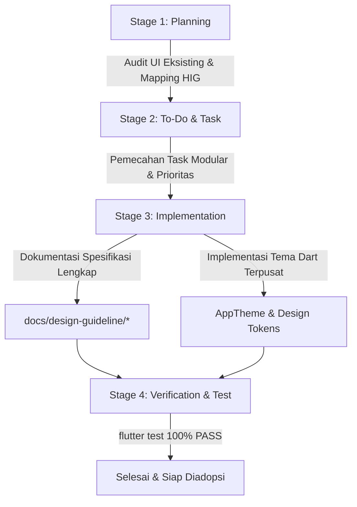

# Panduan Desain Antarmuka & Pengalaman Pengguna (HIG Design System) — HidroSense Mobile

Dokumen ini merupakan panduan induk (*Master Design & UX Guideline*) untuk pengembangan dan rekonstruksi antarmuka aplikasi mobile **HidroSense (Flutter)**. Panduan ini mengadaptasi prinsip-prinsip desain kelas dunia dari [Apple Human Interface Guidelines (HIG)](https://developer.apple.com/design/human-interface-guidelines/) dengan mempertahankan 100% palet warna identitas HidroSense yang sudah ada.

---

## 1. Visi & Filosofi Desain

Aplikasi HidroSense dirancang untuk beroperasi di lingkungan pertanian hidroponik modern (greenhouse & IoT). Antarmuka harus memberikan pengalaman **native, jernih, responsif, dan tanpa friksi** baik bagi pemilik kebun (*Petani*) maupun staf lapangan (*Pegawai*).

Mengacu pada 3 pilar utama **Apple Human Interface Guidelines**:

1. **Clarity (Kejelasan):**
   - Tipografi yang sangat terbaca dengan kontras tajam.
   - Ikonografi yang bermakna presisi dan konsisten.
   - Hirarki visual tegas: informasi kritis (stok menipis, semaian siap pindah, peringatan cuaca) langsung tertangkap pandangan dalam $\le 2$ detik.

2. **Deference (Ketundukan pada Konten):**
   - Antarmuka tidak mendominasi atau bersaing dengan data budidaya tanaman.
   - Kanvas latar belakang bersih dan hangat (`#FAFAF7`) membuat kartu status, tabel data, dan grafik metriks menjadi bintang utama.
   - Ornamen dekoratif minim dan hanya digunakan untuk memperjelas konteks (misal: badge status capsule).

3. **Depth (Kedalaman & Hirarki Spasial):**
   - Layering visual yang logis: Kanvas dasar $\rightarrow$ Kartu Konten Permukaan $\rightarrow$ Modal Bottom Sheet $\rightarrow$ Alert/Pop-up.
   - Efek blur/translusen halus (*frosted glass/vibrancy*) pada App Bar dan Tab Bar untuk mempertahankan konteks navigasi saat pengguna menggulir halaman.
   - Animasi fisik interaktif (*Emil Kowalski Motion Principles*) dengan respons sentuh instan (skala `0.975–0.985`, kurva `easeOutCubic`, 100–120ms).

---

## 2. Kebijakan Retensi Palet Warna (Color Fidelity)

Sesuai instruksi teknis, **tidak ada perubahan pada kode warna identitas produk**. Seluruh warna yang telah digunakan pada implementasi slicing dipertahankan dan diorganisasi ke dalam semantic token:

| Semantic Token | Nilai Hex / RGB | Peran & Penggunaan |
|---|---|---|
| `primaryMint` | `#39C6C5` / `rgb(57, 198, 195)` | Warna aksen primer, status aktif, progres semaian, tab bar selected |
| `primaryDarkTeal` | `#168681` / `rgb(22, 134, 129)` | Brand mark, ikon outline aktif, teks aksen kontras tinggi |
| `accentLime` | `#DDF45A` / `rgb(221, 244, 90)` | Tombol aksi cepat (+ Semai), highlight panen, tag varietas baru |
| `darkNavy` | `#172231` / `rgb(23, 34, 49)` | Tombol utama (primary CTA), teks display & judul besar |
| `canvasWarm` | `#FAFAF7` / `rgb(250, 250, 247)` | Latar belakang seluruh halaman (*system grouped background*) |
| `cardSurface` | `#FFFFFF` / `rgb(255, 255, 255)` | Permukaan kartu interaktif, form input, dan bottom sheet |
| `borderLight` | `#E5E7EB` / `rgb(229, 231, 235)` | Garis pemisah antar section dan outline kartu |
| `warningOrange` | `#FF9A55` / `rgb(255, 154, 85)` | Peringatan stok menipis, semai lewat umur, kerusakan tanaman |
| `warningBg` | `#FFF3EC` / `rgb(255, 243, 236)` | Latar belakang kartu notifikasi peringatan |
| `textPrimary` | `#111827` / `rgb(17, 24, 39)` | Teks isi utama (body, label form, nilai data) |
| `textSecondary` | `#6B7280` / `rgb(107, 114, 128)` | Teks pembantu, metadata waktu, satuan ukuran |

---

## 3. Struktur Dokumen Panduan

Panduan rekonstruksi ini dipecah ke dalam modul-modul spesifik agar mudah diimplementasikan oleh tim developer mobile:

1. [01-design-system-hig.md](file:///d:/Dev/Projects/hidrosense/docs/design-guideline/01-design-system-hig.md)
   - Spesifikasi Design System: Token warna, Skala Tipografi HIG (*Type Ramp*), Grid Spasi 4pt/8pt, *Continuous Corner Radii* (Squircle), dan Komponen Standar.
2. [02-ux-interaction-guideline.md](file:///d:/Dev/Projects/hidrosense/docs/design-guideline/02-ux-interaction-guideline.md)
   - Pedoman Interaksi & UX: Target Sentuh Minimum 44pt, Fisika Animasi Sentuh, Heuristik Formulir & Input Validasi, Umpan Balik Haptik, Penanganan State (Loading Shimmer, Empty State, Error Retry).
3. [03-user-flows-and-navigation.md](file:///d:/Dev/Projects/hidrosense/docs/design-guideline/03-user-flows-and-navigation.md)
   - Arsitektur Informasi & Navigasi: Hirarki Tab Bar, Navigation Stack, Modal Sheets, dan Diagram Alur Pengguna (User Flows B000–B009) menggunakan format visual Mermaid.
4. [04-user-stories-and-acceptance.md](file:///d:/Dev/Projects/hidrosense/docs/design-guideline/04-user-stories-and-acceptance.md)
   - Persona Pengguna (*Pak Budi* & *Siti*), User Stories komprehensif dari B000 hingga B009, serta Kriteria Penerimaan (*Given-When-Then*) yang selaras dengan UX HIG.
5. [05-implementation-roadmap.md](file:///d:/Dev/Projects/hidrosense/docs/design-guideline/05-implementation-roadmap.md)
   - Peta Jalan Rekonstruksi Kode: Audit 21 halaman & 27 widget yang ada, langkah migrasi per fase, serta integrasi Flutter Theme (`AppTheme`).

---

## 4. Alur Kerja Rekonstruksi (Planning $\rightarrow$ To-Do $\rightarrow$ Implementation)

